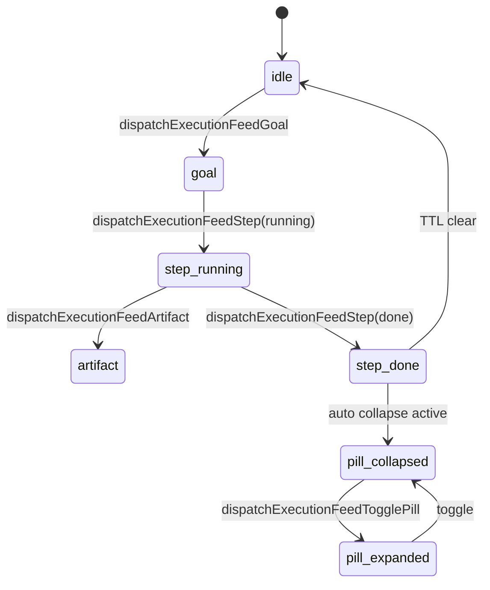

# Globe Prompt Shell — UX SSOT

> **Status:** 2026-06 — **shipped** (Execution Feed + Context Run ingress)  
> **Guardrails:** [GLOBE_EXECUTION_SURFACE_UX.md](./GLOBE_EXECUTION_SURFACE_UX.md) · [CONTEXT_RUN_ENGINE.md](./CONTEXT_RUN_ENGINE.md)

## One line

Globe prompt = **Goal composer** (bottom) + **Execution Feed** (above) — Claude-style **artifacts & pills**, not User/Assistant chat.

---

## Claude → Rimvio mapping

| Claude pattern | Rimvio equivalent | Not chat because |
|----------------|---------------------|------------------|
| User message bubble | **Goal pill** (`의도 · …`) | One-shot goal ingress, no reply thread |
| “Searching…” / tool steps | **Step pills** (horizontal) | Deterministic Run nodes |
| Web result cards + domain pills | **Source chips** on artifact | Projection from context signals |
| Artifact (dashboard, timer, checklist) | **Execution artifact panel** | Surface Resolver output |
| Tab pills (Checklist / Roadmap) | **Artifact `tabs`** + `dispatchExecutionFeedArtifactTab` | Same graphId · interactive |
| Metric cards (6/10, 100+) | `metric_strip` on artifact | Read-only projection |
| “한 줄 요약” box | `summaryLineKo` highlight | Result, not assistant prose |
| PASTED code block | Goal pill / attach chip | Fact ingress label |
| Collapsed prior steps | **Done pills** — tap expand | G8 reconstruct, not scroll restore |

**Forbidden:** alternating User / Assistant messages.

---

## Shell anatomy

```text
┌─ GlobeCaptureDock ─────────────────────────────┐
│  stackAboveCompose (alignment · trade — rare)    │
│  composeAccessory (recall pill)                  │
│                                                  │
│  ┌─ GlobeExecutionFeed ─────────────────────┐  │
│  │ [의도 · 아이폰 팔고 싶어]                  │  │  Goal pill
│  │ [✓ 사진] [● 가격] [맥락 연결]             │  │  Step pill bar
│  │ ┌─ Artifact ───────────────────────────┐  │  │
│  │ │ 한 줄 요약 / metrics / sources       │  │  │  Active panel
│  │ │ checklist / widget CTA               │  │  │
│  │ └──────────────────────────────────────┘  │  │
│  └──────────────────────────────────────────┘  │
│                                                  │
│  ┌─ GlobeContextIngestBar ──────────────────┐  │
│  │ [+] [ Goal 한 줄 ] [전송]                 │  │
│  └──────────────────────────────────────────┘  │
└──────────────────────────────────────────────────┘
```

---

## Execution Feed algorithm



1. **Goal** — composer submit → `dispatchContextRun` → `dispatchExecutionFeedGoal`
2. **Step** — Run node start/done → pill row update
3. **Artifact** — one expanded panel (progress · result · question · widget)
4. **Collapse** — done steps → pills; tap to expand read-only
5. **Clear** — `finishContextRun()` TTL · supply idle TTL · Watcher reconstruct on revisit

---

## Code map

| Piece | Path |
|-------|------|
| Single ingress | `lib/context-run/dispatch-context-run.ts` |
| Feed state | `lib/context-run/execution-feed-bridge.ts` |
| Reducer | `lib/context-run/execution-feed-reducer.ts` |
| Watcher | `lib/context-run/watcher-reconstruct.ts` |
| Lifecycle | `lib/context-run/execution-feed-lifecycle.ts` |
| Intent supply sync | `lib/context-run/sync-intent-supply-to-feed.ts` |
| Market wizard sync | `lib/context-run/sync-market-compose-to-feed.ts` |
| Hook | `hooks/use-globe-execution-feed.ts` |
| UI shell | `components/globe/execution-feed/` |
| Dock mount | `components/globe/globe-capture-dock.tsx` |
| Goal ingress | `components/globe/globe-context-ingest-bar.tsx` |

**Replaced:** `GlobeMapIntentPromptRail` → `GlobeExecutionFeed` (same intent supply bridge).

**2026-06 add:** `@중고` → checklist artifact + tab pills; CaptureSheet ExperienceRun → Feed sync.

---

## Artifact kinds (extend here)

| `kind` | Claude analog | Use |
|--------|---------------|-----|
| `progress` | “Searching…” | Running node |
| `result` | Summary + metrics | After Commit / supply ack |
| `question` | Inline ask | Question Engine slot |
| `approval` | Confirm dialog | Before publish/pay |
| `widget` | Timer / embedded tool | Single-purpose Surface |
| `checklist` | Artifact checklist tab | Multi-step prep |
| `metric_strip` | 4-up score cards | Analysis projection |
| `summary` | Highlight box | One-line recall |

---

## PR checks

1. New UI = Feed artifact or Surface — not new chat thread  
2. One **active** expanded artifact (G3)  
3. Pills reconstruct from RunState + Truth (G8)  
4. No fake progress counts (G7)
