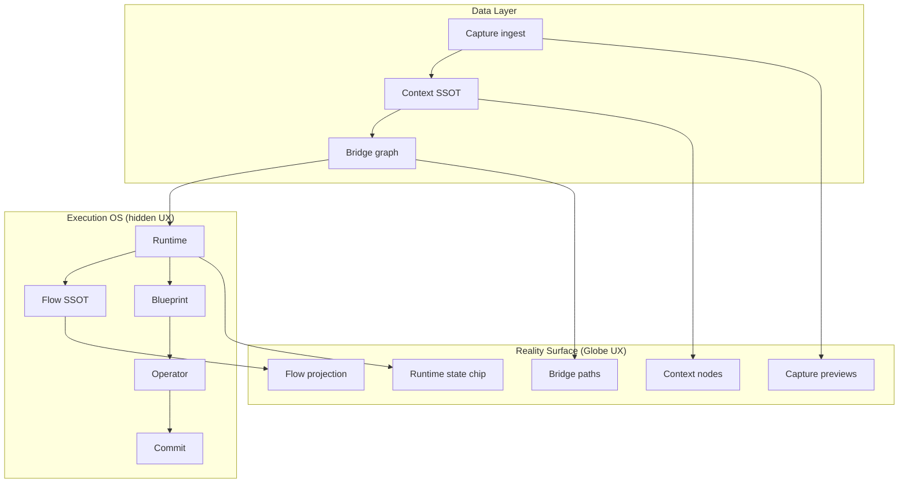

# Reality Surface — Globe UX Layer

**Status:** locked · chief architect · PR gate  
**Date:** 2026-07-06  
**Related:** `docs/RIMVIO_CANONICAL_VOCABULARY_V2.md` · `docs/RIMVIO_SITUATION_PROJECTION_LAYER.md`  
**Code SSOT:** `lib/reality-surface/types.ts` · `components/experience/rimvio-globe-hub.tsx` · `lib/situation-projection/`

---

## One line

**Reality Surface** = the **current-state projection UI layer** on the globe:

```text
Capture + Context + Bridge + Runtime state + Flow projection
```

It shows **what the user sees on Earth** — not how the OS executes behind it.

---

## Full stack (backend vs UI)

```text
── Backend OS (hidden from direct UX) ──────────────────
Capture
  ↓
Context          (SSOT meaning · Globe node data)
  ↓
Bridge           (Context links · memory graph)
  ↓
Runtime          (Process session · mutable state)
  ↓
Flow             (scheduler / phase sequence)
  ↓
Blueprint        (process spec — NOT on surface)
  ↓
Operator         (runtime engine — NOT internals on surface)
  ↓
Commit           (reality change — NOT on surface)

── Globe UX ─────────────────────────────────────────────
Reality Surface  =  projection of:
                      Context + Bridge + Runtime state + Flow
                    (+ Capture as ingest affordances / previews)
```

**User-facing column (your diagram):**

```text
Reality Surface     (UX Layer)
        ↓ reads
Context / Bridge    (Data Layer)
        ↓ drives
Runtime             (Execution OS Layer)   ← v2: not "Container"
        ↓ operated by
Operator            (Runtime Engine)
        ↓ gated by
Commit              (Reality Change · hidden)
```

---

## Included scope (semantic)

| Band | On globe | Examples |
|------|----------|----------|
| **1. Capture** | ✓ | photo/video preview, GPS trace, dwell chip, ingest affordance |
| **2. Context** | ✓ | place node, event pin, people chip, memo caption, **Globe dot** |
| **3. Bridge** | ✓ | Context↔Context links, trip path, 집→공항→호텔 structure, order |
| **4. Runtime state** | ✓ | active session badge, **현재 phase**, active path, “지금 어디까지” |
| **5. Flow projection** | ✓ | progress line, next-step hint, phase strip, dashed ghost legs |

### Included — code map

| Band | Primary code |
|------|----------------|
| Capture | ingest bar · capture sheet · feed captures on pin |
| Context | `EventCandidate` pins · `PinEntity` · globe clusters |
| Bridge | trip leg arcs · entity graph edges · bridge timeline |
| Runtime state | active Runtime chip · Operator header phase summary |
| Flow projection | Flow node progress UI · situation map legs · brain surface path |

**Situation Projection** (`lib/situation-projection/`) is an **engine inside** Reality Surface — composes solid + ghost **layout** for recall moments. It does not replace Reality Surface; it feeds it.

---

## Excluded scope (critical)

Reality Surface **must not** expose:

| Excluded | Why |
|----------|-----|
| **Blueprint** | Process spec — Operator/OS only |
| **Operator internals** | module routing, prompts, Travel Brain slots |
| **Commit logic** | booking APIs, truth write paths, approval FSM |
| **DB / storage schema** | EventCandidate store, projection cache keys |

```text
❌ Blueprint fields on pin metadata
❌ Operator system prompt in UI
❌ Commit buttons that skip approval gate (prep ≠ commit)
❌ Internal runtimeId/blueprintId as hero labels (ok in dev)
```

PR reject: rendering Blueprint JSON on globe · showing “Container AI” module names · auto-commit from surface tap.

---

## OS analogy

| Layer | Analogy |
|-------|---------|
| Context / Bridge / Runtime / Flow (data) | Files + process state in kernel |
| Reality Surface | **Desktop / compositor** — pixels user sees |
| Blueprint / Operator / Commit | Kernel syscalls + scheduler — **not drawn** |

---

## What user sees vs what OS owns

| User sees (Reality Surface) | OS owns (hidden) |
|-----------------------------|------------------|
| Globe pin (Context) | `contextId` SSOT row |
| Path lines (Bridge) | `bridgeId` graph |
| “Stay · preparing” chip | Runtime + Flow **projection** |
| Dashed next leg | Flow ghost projection |
| Trip Assistant bubble | **Operator** surface (chrome only) |
| Confirm booking | **Commit** (Field / approval sheet — not globe root) |

---

## Relationship to v2 vocabulary

| v2 term | Reality Surface role |
|---------|----------------------|
| **Capture** | ingest previews · traces |
| **Context** | **primary visible node** |
| **Bridge** | **visible links / path** |
| **Runtime** | **state chip** (active session), not storage |
| **Flow** | **progress visualization** only |
| **Blueprint** | excluded |
| **Operator** | user chrome; internals excluded |
| **Commit** | excluded (downstream sheets) |

---

## Layer diagram (complete)



---

## PR gate

1. Is this pixel on the globe? → must be in **included** bands only.
2. Does it expose Blueprint / Commit / Operator routing? → reject.
3. Is Flow shown as **projection** (dashed ok) not as editable spec? → required.
4. Ghost legs on surface → projection cache only; solid only after Commit.

---

## Wire

```typescript
REALITY_SURFACE_INCLUDED_LAYERS =
  capture | context | bridge | runtime_state | flow_projection

REALITY_SURFACE_EXCLUDED_LAYERS =
  blueprint | operator_internals | commit_logic | storage_schema
```

`lib/reality-surface/types.ts` · `composeRealitySurfaceProjectionBundle()` · `composeRealitySurfaceFromGlobeIngress()`

Tests: `scripts/test-reality-surface-projection.ts`
