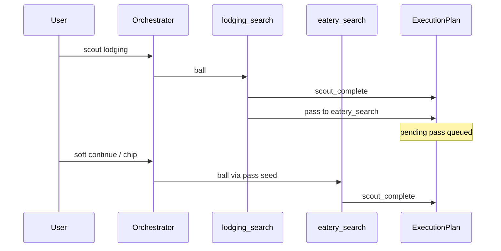
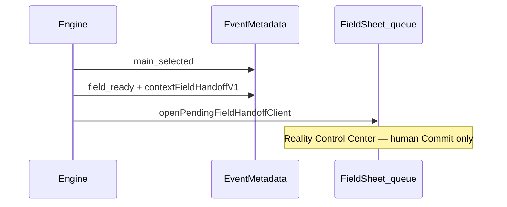

# Rimvio Team Collaboration (축구형 협업)

**Status:** v0 — Phases 1–4 shipped (thin pitch HUD)  
**Related:** [`RIMVIO_ENGINE.md`](./RIMVIO_ENGINE.md) · [`RIMVIO_EXECUTION_PLAN.md`](./RIMVIO_EXECUTION_PLAN.md) · Context OS Article 0

---

## Shift

| Before | After |
|--------|--------|
| Organs — each layer/engine only its job; one ball touch per turn | **Football** — same positions, but **pass / assist / formation** toward one Context Run goal |
| Isolation as end state | Isolation as **role**; collaboration via events + Plan (never silent Reality) |

**Law unchanged:** Blueprint never executes · Execution never decides · Reality only via Commit · humans own final authority.

```text
Captain (Human)
    │
Coach (Operator / Orchestrator) — who gets the ball this turn
    │
Formation (Execution Plan · installed engines)
    │
Players (Engines) ──pass──► ──assist──► ──field_ready──► Field (queue) → Commit
```

---

## Phases (do in order)

### Phase 1 — Domain engine team ✅

**Goal:** Installed engines can **pass** the next turn to a teammate after `scout_complete` / `main_selected`.

| Primitive | Wire |
|-----------|------|
| Pass queue | `contextEnginePassQueueV1` on Event metadata |
| Pass event | `contextEngineEventsV1` kind `pass` · `assist` |
| Default formation | travel: lodging → eatery → activity → transit |
| Routing | `planRimvioEngineTurn` honors pending pass (after Plan schedule) |

**SSOT:** `lib/engine/team-collab/` · `lib/engine/engine-event-metadata.ts`

### Phase 2 — Globe ↔ Field ✅

**Goal:** After MAIN (one-answer), pass prepared work into Field Reality queue — no new UI, no silent Commit.

| Primitive | Wire |
|-----------|------|
| Field handoff | `contextFieldHandoffV1` on Event metadata |
| Event | `field_ready` on `contextEngineEventsV1` |
| Open | `openPendingFieldHandoffClient` → `openFieldDashboardIngress({ tab: "queue" })` |
| Call sites | flight / transit / finance MAIN; lodging MAIN when express checkout did not open |

### Scout quality coach (Cursor-like replan) ✅

After every scout (handlePinned):

1. **Quality gate** — `evaluateScoutQualityGate` (min 3 recommendations; budget via `contextScoutQualityBudgetV1`)
2. **Merge** — `mergeDiscoveryRetryIntoActiveFeed` (same Discovery/Feed, keep batchId)
3. **Insufficient** — `scout_insufficient` + pass queue replan (`widen_same` → `alternate_engine`) + `requestOperatorAutoRun`
4. **Exhausted** — Field handoff human decision (`queueEngineFieldHandoffForHumanDecision`)

**SSOT:** `lib/globe/discovery-quality/`

### Phase 3 — Multi Operator ✅

**Goal:** Explicit roles Architect / Operator / Human — stamps + reuse trade dual-approval (no parallel chat OS).

| Primitive | Wire |
|-----------|------|
| Roles | `architect` · `operator` · `human` |
| Stamps | `contextMultiOperatorApprovalV1` |
| Operator stamp | on `main_selected` → `field_ready` |
| Human stamp | after Reality queue Commit succeeds |
| Trade dual | `isTradeDualApproved` (seeking + listing) — existing negotiation rooms |

### Phase 4 — Full pitch vision ✅ (thin)

**Goal:** Match status (who has the ball) on Context hub timeline — compositor only.

| Primitive | Wire |
|-----------|------|
| Status | `readTeamPitchStatus` |
| UI | hub timeline row `kind: "pitch"` (existing rail, no new surface) |

---

## Phase 1 flows



## Phase 2 flows



**Not allowed:** Engine A mutating Engine B’s memory slots · rewriting Blueprint · auto-Committing Reality · new Field UI surfaces.

---

## Tests

```bash
npx tsx scripts/test-engine-team-collab.ts
npm run test:engine
```
